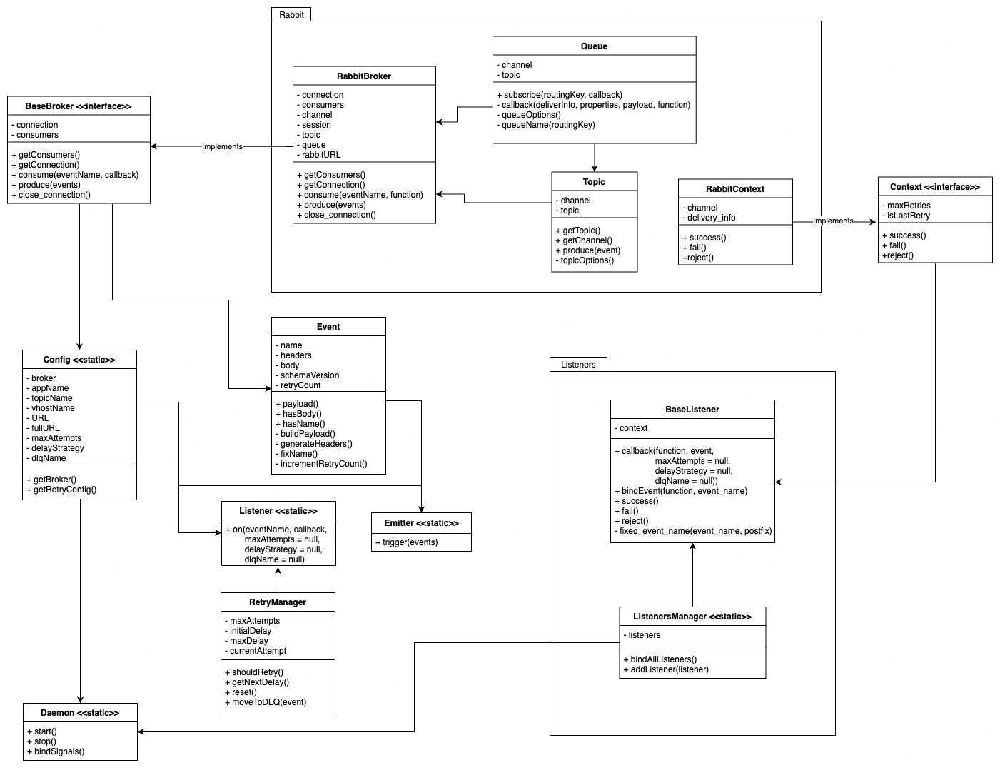

# EventPeople

EventPeople is a tool to simplify the communication of event based services. It is an based on the [EventBus](https://github.com/EmpregoLigado/event_bus_rb) gem.

The main idea is to provide a tool that can emit or consume events based on its names, the event name has 4 words (`resource.origin.action.destination`) which defines some important info about what kind of event it is, where it comes from and who is eligible to consume it:

- **resource:** Defines which resource this event is related like a `user`, a `product`, `company` or anything that you want;
- **origin:** Defines the name of the system which emitted the event;
- **action:** What action is made on the resource like `create`, `delete`, `update`, etc. PS: *It is recommended to use the Simple Present tense for actions*;
- **destination (Optional):** This word is optional and if not provided EventPeople will add a `.all` to the end of the event name. It defines which service should consume the event being emitted, so if it is defined and there is a service whith the given name only this service will receive it. It is very helpful when you need to re-emit some events. Also if it is `.all` all services will receive it.

As of today EventPeople uses RabbitMQ as its datasource, but there are plans to add support for other Brokers in the future.

## Usage

### Events

The main component of `EventPeople` is the `Event` class which wraps all the logic of an event and whenever you receive or want to send an event you will use it.

It has 2 attributes `name` and `payload`:

- **name:** The name must follow our conventions, being it 3 (`resource.origin.action`) or 4 words (`resource.origin.action.destination`);
- **payload:** It is the body of the massage, it should be a Hash object for simplicity and flexibility.

There are 3 main interfaces to use `EventPeople`:

- Calling `Emitter.trigger(event: Event)` inside your project;
- Calling `Listener.on(event_name: String)` inside your project;
- Or extending `BaseListeners` and use it as a daemon.

### Using the Emitter
You can emit events on your project passing an `eventPeople.Event` instance to the `eventPeople.Emitter.trigger` method. Doing this other services that are subscribed to these events will receive it.

### Listeners

You can subscribe to events based on patterns for the event names you want to consume or you can use the full name of the event to consume single events.

We follow the RabbitMQ pattern matching model, so given each word of the event name is separated by a dot (`.`), you can use the following symbols:

- `* (star):` to match exactly one word. Example `resource.*.*.all`;
- `# (hash):` to match zero or more words. Example `resource.#.all`.

Other important aspect of event consumming is the result of the processing we provide 3 methods so you can inform the Broker what to do with the event next:

- `success:` should be called when the event was processed successfuly and the can be discarded;
- `fail:` should be called when an error ocurred processing the event and the message should be requeued;
- `reject:` should be called whenever a message should be discarded without being processed.

Given you want to consume a single event inside your project you can use the `eventPeople.Listener.on` method. It consumes a single event, given there are events available to be consumed with the given name pattern.

#### Multiple events routing

If your project needs to handle lots of events you can extend `BaseListeners` class to bind how many events you need to instance methods, so whenever an event is received the method will be called automatically.

#### Creating a Daemon

If you have the need to create a deamon to consume messages on background you can use the `eventPeople.Daemon.start` method to do so with ease. Just remember to define or import all the event bindings before starting the daemon.

## Implementations and Contributions

We have the tool implemented in 4 Technologies:

- Ruby: https://github.com/pin-people/event_people_ruby
- Python: https://github.com/pin-people/event_people_python
- Node(Typescript): https://github.com/pin-people/event_people_node
- Go: https://github.com/pin-people/event_people_go

But if you want to use it on your project and the Technology is not supported, don't worry, below is the class Diagram so you can implement it yourself:

## License

The module is available as open source under the terms of the [LGPL 3.0 License](https://www.gnu.org/licenses/lgpl-3.0.en.html).
